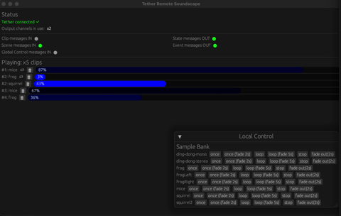

# Tether Soundscape rs

A multi-layered audio sequencer, remote-controllable via Tether, to create soundscapes.



## Stereo vs Multichannel mode
In the default mode (**stereo**), clips can be mono or stereo. Mono clips will be duplicated to both Left and Right output channels (dual mono), and stereo clips will play as normal (left and right channels directed correctly).

In **multichannel** mode (`--multiChannel`), you must provide *only* mono files. You can then use "panning" (later this could be 2D or even 3D spatialised audio) to direct how the input channel is replicated to the available output channels.

## Remote control (Input from Tether)

### Single Clip Commands
On the topic `+/+/clipCommands`

Has the following fields
- `command` (required): one of the following strings: "hit", "add", "remove"
  - "hit" does not loop
  - "add" does loop
- `clipName` (required): string name for the targetted clip
- `fadeDuration` (optional): an integer value for milliseconds to fade in or out (command-dependent)
- `panPosition`, `panSpread` (both optional): if `panPosition` is specified, this will override any per-clip panning or manually-specified panning (in the UI)

### Scene Messages
On the topic `+/+/scenes`

Has the following fields
- `mode` (optional, default is "loopAll"): one of the following strings: "loopAll", "onceAll", "onceRandom",
- `clipNames` (required): zero or more clip names; if zero are provided, the system will transition to an empty scene (silence all clips)
- `fade_duration` (optional):  an integer value for milliseconds to transition from current scene to the new one

### Global Controls
On the topic `+/+/globalControls`

**TODO: these are not functional yet**
### Examples

Single clip hit:
```
tether-send --host 127.0.0.1 --topic dummy/dummy/clipCommands --message \{\"command\":\"hit\"\,\"clipName\":\"frog\"\}
```

Single clip hit, specify panning (ignored if in Stereo Mode):
```
tether-send --host 127.0.0.1 --topic dummy/dummy/clipCommands --message \{\"command\":\"hit\"\,\"clipName\":\"frog\"\,\"panPosition\":0,\"panSpread\":1\}
```


Scene with two clips (default mode is "loopAll"):
```
tether-send --host 127.0.0.1 --topic dummy/dummy/scenes --message \{\"clipNames\":\[\"frog\"\,\"squirrel\"]\}
```

Scene where system should "pick one random" from the list:
```
tether-send --host 127.0.0.1 --topic dummy/dummy/scenes --message \{\"mode\":\"random\",\"clipNames\":\[\"frog\"\,\"squirrel\"]\}
```

Remove single clip
```
tether-send --host 127.0.0.1 --topic dummy/dummy/clipCommands --message \{\"command\":\"remove\",\"clipName\":\"frog\"\}
```

Add single clip, custom fade duration
```
tether-send --host 127.0.0.1 --topic dummy/dummy/clipCommands --message \{\"command\":\"add\",\"clipName\":\"squirrel2\",\"fadeDuration\":5000\}
```

Scene with zero clips (silence all), custom fade duration:
```
tether-send --host 127.0.0.1 --topic dummy/dummy/scenes --message \{\"clipNames\":\[\],\"fadeDuration\":500\}
```

## Output to Tether

### State
This agent publishes frequently (every UPDATE_INTERVAL ms) on the topic `soundscape/unknown/state`, which can be useful for driving animation, lighting effects, visualisation, etc. in sync with playback. The state messages include the following fields:

- `isPlaying`: whether or not the audio stream is playing
- `clips`: an array of currently playing clips (only), with the following information for each:
  - `id` (int)
  - `name` (string)
  - `progress` (float, normalised to range [0,1])
  - `currentVolume` (float, normalised to range [0,1])
  - `looping` (boolean)

To minimise traffic, the agent will only publish an empty clip list (`clips: []`) **once** and then resume as soon as at least one clip begins playing again.

### Events
TODO: discrete events (clip begin/end) should be published in addition to the stream of "state" messages. This could be useful for driving external applications that only need to subscribe to significant begin/end events.

___
## Why 🦀 Rust?:
- Minimal memory/CPU footprint for high performance
- Cross-platform but without any need to install browser, use Electron, etc.
- Visualisation via Nannou
- Great way to learn about low-level audio sample/buffer control, multi-threading in Rust (Nannou always uses separate "realtime" thread for audio)

___ 

## TODO - rodio/egui version:
- [x] Re-implement Phases
- [x] Fade in/out should use Phase/Tweens
- [x] Volume respected from sample bank?
- [x] Text-only mode
- [x] Panning reimplemented: use https://docs.rs/rodio/latest/rodio/source/struct.ChannelVolume.html ?
- [x] GUI show Tether enabled/connected status
- [ ] GUI show incoming messages and/or counts
- [ ] GUI show output levels per channel somehow?
- [ ] Publish state regularly / events on events
- [ ] Allow MIDI to trigger clips (MIDI Mediator and/or directly)
- [ ] Allow bank to be created, edited, saved directly from GUI, start from "blank" or load demo if nothing
- [ ] Drag and drop samples into bank
- [ ] Visualise clip playback in circles, not just progress bars

## TODO - original:
- [x] Apply "loop" as well as trigger/hit/once-off functions
- [x] Allow clips to be stopped/removed while playing (without stopping whole stream)
- [x] Allow starting/fixed "maximum" volume per clip to be applied
- [x] Apply fade in/out volume controls
- [x] Draw clip progress and volume
- [x] Allow "scenes" to be triggered (with transition)
- [ ] Make use of tempo, quantisation for timing
- [x] Env logging, CLI params
- [x] Add Tether remote control commands, as per API in [original](https://github.com/RandomStudio/tether-soundscape)
- [x] Publish clip state / progress so that an external application can do visualisation or animation, for example
- [x] Allow for multi-channel output, at least "one clip per channel" config
- [x] Stereo source files should be handled differently from mono, i.e. add to channels 1 and 2 (in stereo output)
- [x] CLI should allow custom path to JSON sample bank file
- [x] New standard demo clips (48Khz, stereo + mono)
- [x] Panning settings should be possible within instruction messages
- [x] Panning settings should be optionally provided from sample banks (can be overriden)
- [ ] Provide utility/test modes, e.g. tone per channel
- [x] Allow for random selection triggers (like "scene", but pick-one within the list)
- [ ] Direct MIDI control or MIDI-to-Tether Agent
- [ ] Stream/global level instructions, e.g. "play", "pause" (all), "silenceAll", "master volume", etc.
- [ ] Publish on separate topic for "events" - only when clip(s) begin/end
- [ ] Separate CLIP and STREAM sample rates are currently a problem - might need a separate Reader (and thread!) for each clip if sample rates are allowed to differ
- [ ] Optionally connect to [Ableton link](https://docs.rs/ableton-link/latest/ableton_link/)
- [ ] Possibly distribute radius by "index" not (only?) duration to avoid overlapping circles
- [ ] Allow input plugs to be subscribed to with a specified group (optional), so `+/someGroup/clipCommands` rather than the default `+/+/clipCommands`, and also publish on `soundscape/someGroup/state` 
- [ ] Basic ADSR (or just Attack-Release) triggering for samples
- [ ] Low/no graphics mode
- [ ] Demonstrate running (headless?) on Raspberry Pi
